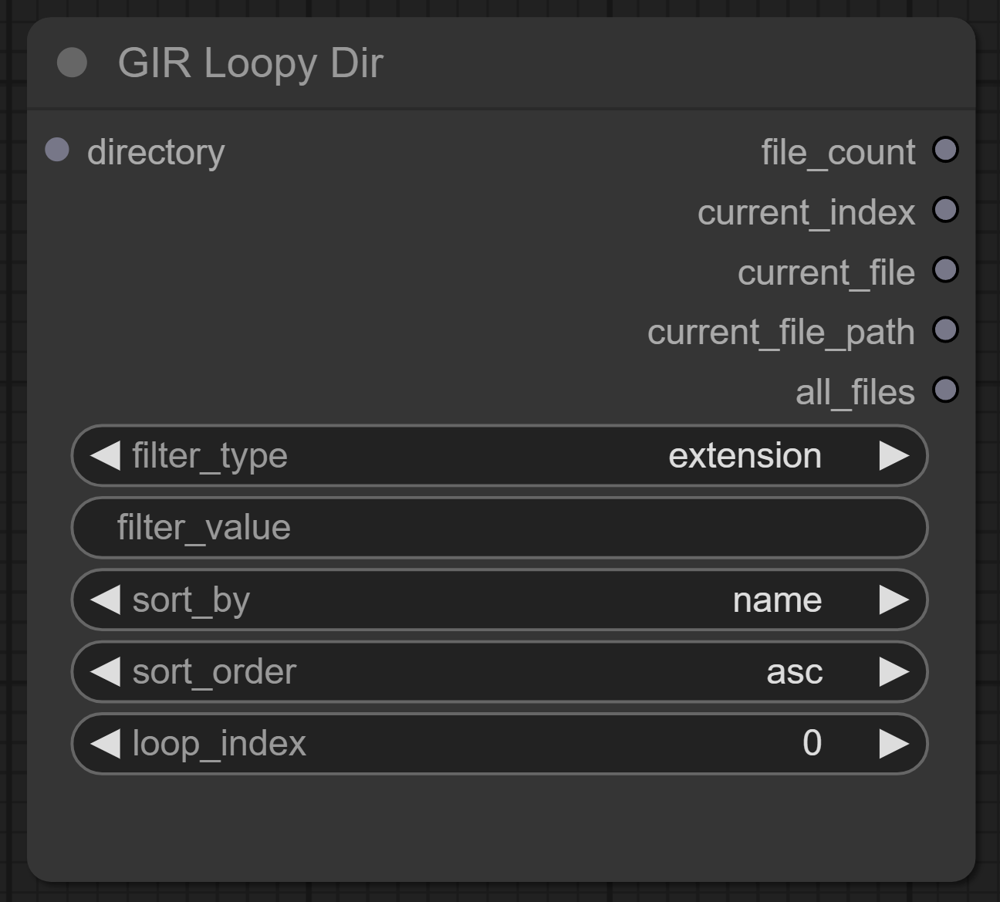
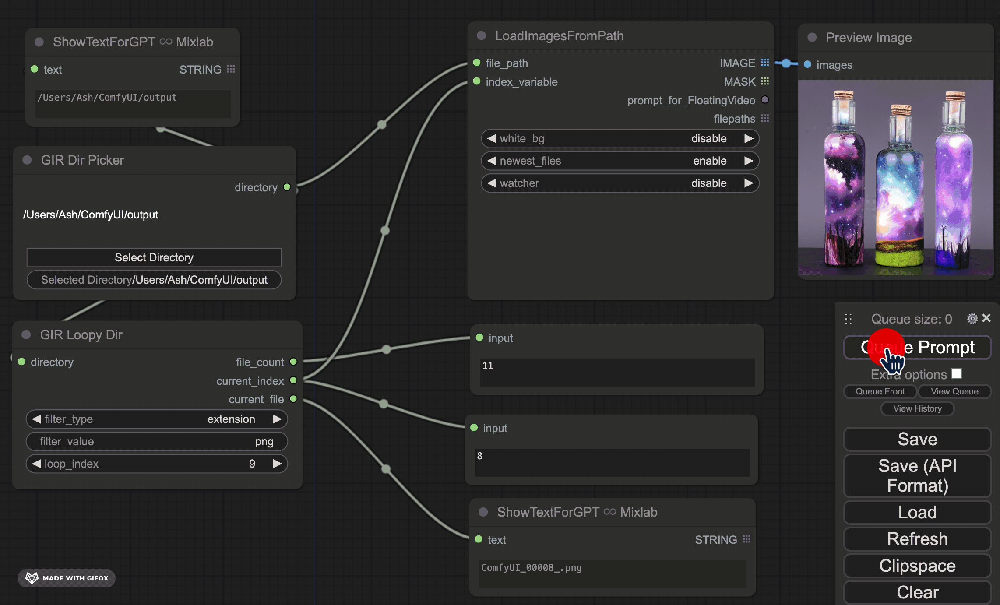

# ComfyUI Directory GIR (Get It Right)

Utility nodes to get directories right in ComfyUI. Ever want to select a random directory and loop bulk queue more than the number of files available automatically reverting to 0 index after they were all done? So did I!


To create this custom node pack, I uploaded the sparse ComfyUI documentation, a few custom node sources, and app js source code to an OpenAi GPTs [ComfyUI Craftsman](https://chat.openai.com/g/g-pYtHuQdGh-comfyui-craftsman), this GPTs is good at answering questions and offering guidance based on real ComfyUI implementations.

## Installation

Tkinker is required, launching this custom node will attempt to install automatically. If this fails, the Directory Picker will not work properly. See [TKinker Installation](https://tkdocs.com/tutorial/install.html)

#### Comfy Manager

Search `Dirgir` in Comfy Manager!


#### Manual installation:

```bash
cd Your_ComfyUI_Path/custom_nodes
git clone https://github.com/AshMartian/ComfyUI-DirGir
```

Then restart ComfyUI

## Nodes

|                                 Node                                  | Description                                                                                                                                                                                                                                                                                                                                                                                                                                        |
| :-------------------------------------------------------------------: | :------------------------------------------------------------------------------------------------------------------------------------------------------------------------------------------------------------------------------------------------------------------------------------------------------------------------------------------------------------------------------------------------------------------------------------------------- |
| GIR Directory Picker | **"Select Directory"** opens a GUI file browser using `tkinker`, the selected directory is persistent on disk (server restarts are no problem!), and available via output string. Changing the Selected Directory manually is supported too.                                                                                                                                                                                                       |
|         GIR Loopy Dir         | Directory in, automatic loopy-ness out. Auto-increment and auto resetting, when the `loop_index` reaches the end of filtered files in directory, goes back to zero. Filter by extension or regex, manually change `loop_index` to override! Note: When queuing, the `loop_index` will increment in real time, queuing over the number of files available is no problem, the `loop_index` will tell you what index is next as the queue progresses. |
|      GIR Image Nabber        | A simple path to image node, for working with results of Loopy Dir without relying on an external node pack that has it's own directory filtering logic _(For videos, use [VHS Load Video (Path)](https://github.com/Kosinkadink/ComfyUI-VideoHelperSuite/blob/main/videohelpersuite/load_video_nodes.py#L197)_)                                                                                                                                   |
|        GIR Happy Dance!\*          | These nodes simplify and streamline the process of directory selection and iteration, making complex tasks feel like a breeze. With the ability to effortlessly pick directories and loop through files with smart reset capabilities, GIR is over the moon, knowing users can focus on creativity and productivity, leaving the tedious parts to the automation magic of ComfyUI DirGir.                                                          |

## Examples

Get It Right Directory Picker (Tested on MacOS\*\* and Windows)


A simple workflow using both nodes

- GIR Dir Picker outputting a directory to both `GIR Loopy Dir` and `LoadImagesFromPath`
- GIR Loopy Dir configured to filter for file extensions of png, outputs 11 matching files
- current_index connected to `LoadImagesFromPath`
- As the queue is prompted, new images load
- As the queue goes beyond the file_count, loop_index is reset automatically.



Regex Usage

- The problem with using `LoadImagesFromPath` is it's own built in directory filtering and index logic. GIR Loopy Dir will output filtered indexes that don't always align (especially with regex).
- Using `GIR Image Nabber` we can reliably load images from a direct path.


\*GIR Happy dance is not a real node, open an Issue to request it!

\*\*MacOS Works great on first directory selection, but on subsequent selections the directory browser is behind web browser. Not an issue on Windows.
