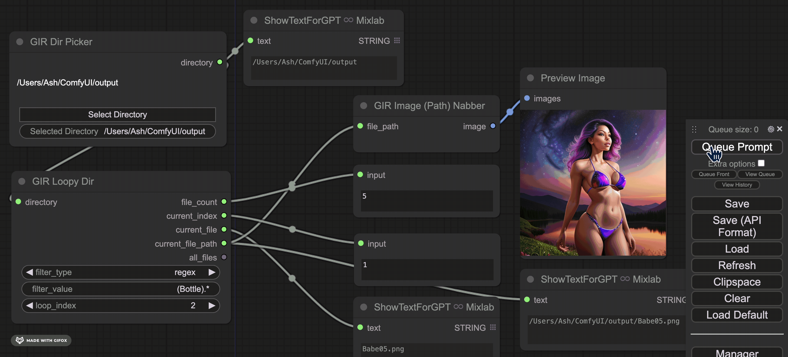

# ComfyUI Directory GIR (Get It Right)

Utility nodes to get directories right in ComfyUI


## Installation

Tkinker is required, launching this custom node will attempt to install automatically. If this fails, the Directory Picker will not work properly. See [TKinker Installation](https://tkdocs.com/tutorial/install.html)

Manual installation:

```bash
cd Your_ComfyUI_Path/custom_nodes
git clone https://github.com/AshMartian/ComfyUI-DirGir
```

Then restart ComfyUI

## Nodes

|                                 Node                                  | Description                                                                                                                                                                                                                                                                                                                                                                               |
| :-------------------------------------------------------------------: | :---------------------------------------------------------------------------------------------------------------------------------------------------------------------------------------------------------------------------------------------------------------------------------------------------------------------------------------------------------------------------------------- |
| GIR Directory Picker | **"Select Directory"** opens a GUI file browser using `tkinker`, the selected directory is persistent on disk (server restarts are no problem!), and available via output string. Changing the Selected Directory manually is supported too.                                                                                                                                              |
|         GIR Loopy Dir         | Directory in, automatic loopy-ness out. Auto-increment and auto resetting, when the `loop_index` reaches the end of filtered files in directory, goes back to zero. Filter by extension or regex, manually change `loop_index` to override!                                                                                                                                               |
|        GIR Happy Dance!\*          | These nodes simplify and streamline the process of directory selection and iteration, making complex tasks feel like a breeze. With the ability to effortlessly pick directories and loop through files with smart reset capabilities, GIR is over the moon, knowing users can focus on creativity and productivity, leaving the tedious parts to the automation magic of ComfyUI DirGir. |

## Examples

Get It Right Directory Picker (Tested on MacOS and Windows)


A simple workflow using both nodes

- GIR Dir Picker outputting a directory to both `GIR Loopy Dir` and `LoadImagesFromPath`
- GIR Loopy Dir configured to filter for file extensions of png, outputs 11 matching files
- current_index connected to `LoadImagesFromPath`
- As the queue is prompted, new images load
- As the queue goes beyond the file_count, loop_index is reset automatically.


Regex Usage



\*GIR Happy dance is not a real node, open an Issue to request it!
